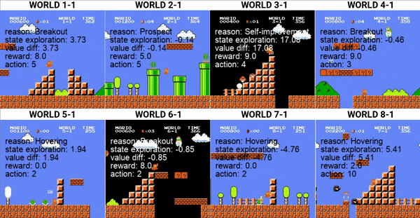
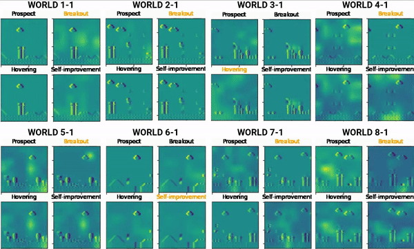

Environment: python 3.7.9

cv2==4.4.0 \
gym==0.19.0 \
scipy==1.1.0 \
torch==1.13.1 \
numpy==1.19.2 \
pandas==1.2.1 \
seaborn==0.11.2 \
sklearn==0.24.2 \
skimage==0.17.2 \
IPython==7.19.0 \
csv==1.0 \
matplotlib==3.5.1

These are examples of trained agents playing on the Super Mario Bros environment:

These are examples of state saliency maps on agent intents:

